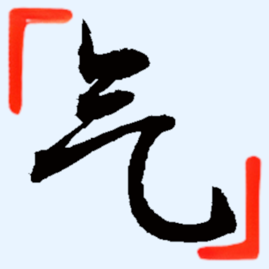

<div id="top"></div>

<!-- PROJECT SHIELDS -->
<!--
*** I'm using markdown "reference style" links for readability.
*** Reference links are enclosed in brackets [ ] instead of parentheses ( ).
*** See the bottom of this document for the declaration of the reference variables
*** for contributors-url, forks-url, etc. This is an optional, concise syntax you may use.
*** https://www.markdownguide.org/basic-syntax/#reference-style-links
-->
[![Lines of Code][loc-shield]][loc-url]
[![License][license-shield]][license-url]
[![Website][website-shield]][website-url]
[![Size][size-shield]][size-url]
<!-- PROJECT LOGO -->
<br />
<div align="center">
  <a href="https://github.com/anonymousaaardvark/qi">
    
  </a>

<h2 align="center">气 (qi) lang</h3>

  <p align="center">
    Qi is a lightweight, fast, and open source Chinese programming language.
    <br />
    <a href="https://github.com/othneildrew/Best-README-Template"><strong>qilang.tk »</strong></a>
    <br /><br />
    English |
    <a href="https://github.com/othneildrew/Best-README-Template/issues">中文</a>
  </p>
</div>

[![Background][background-img]]()

<!-- ABOUT THE PROJECT -->
## About

After reading an article on how programming languages are created, I was inspired to create an interpreter myself. I took a look at how several languages were implemented, and realized that all of them were based on english. I wanted to make a programming language based on a "foreign" natural language, such as Chinese, and see what drawbacks it might lead to. I started simple by referencing various resources posted online (most notably [Crafting Interpreters](https://github.com/munificent/craftinginterpreters/)), and then slowly began implementing concepts mostly on my own. Turns out that creating an entire programming language from scratch is pretty tough, but that was what made it fun.

**Why name it Qi?** Qi was derived from the pinyin of the Chinese character "气", which means "air" in English. I wanted this language to be quick and lightweight, as well as fully transparent, just like air! 
```asm
打印行（"你好，世界"）；
```
### Features
- Qi is <ins>Chinese-based</ins>. Us English-speaking people don't often take for granted the fact that the programming languages we learn are all based on native tongues we're already fluent in. A native English speaker can reasonably infer what a piece of Python code does just from reading the keywords ("if", "int", "while", etc.). Making this language foreign-based allows programming to be more accessible to more people around the globe. 
- Qi is <ins>fast</ins>. Qi utilizes a single-pass compiler that compiles to efficient bytecode that runs exceptionally down to the metal. Along with various optimizations such as [Nan Boxing](https://sean.cm/a/nan-boxing) and hash table probing, Qi's speed squares up to competing dynamic languages.
- Qi is <ins>light</ins>. With less than 5000 lines of code, the entire project could be read in a day. Although the code is short, everything is well-formatted and easy to understand. The final executable is only about 140 kb in size, allowing you to run it on nearly any unix device imaginable.  
- Qi is <ins>object-oriented</ins>. Placing classes front and center, [object-oriented programming](https://en.wikipedia.org/wiki/Object-oriented_programming) provides a clear modular structure that is significantly better at handling complexity than functional programming though concepts such as [abstraction](https://en.wikipedia.org/wiki/Abstraction_principle_(computer_programming)) and [encapsulation](https://en.wikipedia.org/wiki/Encapsulation_(computer_programming)). 

## Performance

This section should list any major frameworks/libraries used to bootstrap your project. Leave any add-ons/plugins for the acknowledgements section. Here are a few examples.

* [Next.js](https://nextjs.org/)
* [React.js](https://reactjs.org/)
* [Vue.js](https://vuejs.org/)
* [Angular](https://angular.io/)
* [Svelte](https://svelte.dev/)
* [Laravel](https://laravel.com)
* [Bootstrap](https://getbootstrap.com)
* [JQuery](https://jquery.com)


<!-- GETTING STARTED -->
## Getting Started

This is an example of how you may give instructions on setting up your project locally.
To get a local copy up and running follow these simple example steps.

### Prerequisites

This is an example of how to list things you need to use the software and how to install them.
* npm
  ```sh
  npm install npm@latest -g
  ```

### Installation

_Below is an example of how you can instruct your audience on installing and setting up your app. This template doesn't rely on any external dependencies or services._

1. Get a free API Key at [https://example.com](https://example.com)
2. Clone the repo
   ```sh
   git clone https://github.com/your_username_/Project-Name.git
   ```
3. Install NPM packages
   ```sh
   npm install
   ```
4. Enter your API in `config.js`
   ```js
   const API_KEY = 'ENTER YOUR API';
   ```


<!-- USAGE EXAMPLES -->
## Usage

Use this space to show useful examples of how a project can be used. Additional screenshots, code examples and demos work well in this space. You may also link to more resources.

_For more examples, please refer to the [Documentation](https://example.com)_


<!-- ROADMAP -->
## Roadmap

- [x] Add Changelog
- [x] Add back to top links
- [ ] Add Additional Templates w/ Examples
- [ ] Add "components" document to easily copy & paste sections of the readme
- [ ] Multi-language Support
    - [ ] Chinese
    - [ ] Spanish
    


<!-- CONTRIBUTING -->
## Contributing

Contributions are what make the open source community such an amazing place to learn, inspire, and create. Any contributions you make are **greatly appreciated**.

If you have a suggestion that would make this better, please fork the repo and create a pull request. You can also simply open an issue with the tag "enhancement".
Don't forget to give the project a star! Thanks again!

1. Fork the Project
2. Create your Feature Branch (`git checkout -b feature/AmazingFeature`)
3. Commit your Changes (`git commit -m 'Add some AmazingFeature'`)
4. Push to the Branch (`git push origin feature/AmazingFeature`)
5. Open a Pull Request


<!-- LICENSE -->
## License

Distributed under the MIT License. See `LICENSE.txt` for more information.


<!-- CONTACT -->
## Contact

Your Name - [@anonymousaaardvark](https://twitter.com/anonymousaaardvark) - andrewhuiyang0830@gmail.com

Project Link: [https://github.com/anonymousaaardvark/qi](https://github.com/anonymousaaardvark/qi)


<!-- ACKNOWLEDGMENTS -->
## Acknowledgments

Use this space to list resources you find helpful and would like to give credit to. I've included a few of my favorites to kick things off!

* [Choose an Open Source License](https://choosealicense.com)
* [GitHub Emoji Cheat Sheet](https://www.webpagefx.com/tools/emoji-cheat-sheet)
* [Malven's Flexbox Cheatsheet](https://flexbox.malven.co/)
* [Malven's Grid Cheatsheet](https://grid.malven.co/)
* [Img Shields](https://shields.io)
* [GitHub Pages](https://pages.github.com)
* [Font Awesome](https://fontawesome.com)
* [React Icons](https://react-icons.github.io/react-icons/search)


<!-- MARKDOWN LINKS & IMAGES -->
<!-- https://www.markdownguide.org/basic-syntax/#reference-style-links -->
[loc-shield]: https://img.shields.io/tokei/lines/github/anonymousaaardvark/qi?style=for-the-badge
[loc-url]: https://github.com/anonymousaaardvark/qi
[last-commit-shield]: https://img.shields.io/github/last-commit/anonymousaaardvark/qi?style=for-the-badge
[last-commit-url]: https://github.com/anonymousaaardvark/qi
[commit-activity-shield]: https://img.shields.io/github/commit-activity/m/anonymousaaardvark/qi?style=for-the-badge
[commit-activity-url]: https://github.com/anonymousaaardvark/qi
[license-shield]: https://img.shields.io/github/license/anonymousaaardvark/qi?style=for-the-badge
[license-url]: https://github.com/anonymousaaardvark/qi
[website-shield]: https://img.shields.io/website?down_color=lightgrey&down_message=offline&style=for-the-badge&up_color=blue&up_message=online&url=https%3A%2F%2Fqilang.tk
[website-url]: https://qilang.tk
[size-shield]: https://img.shields.io/github/repo-size/anonymousaaardvark/qi?style=for-the-badge
[size-url]: https://github.com/anonymousaaardvark/qi
[background-img]: images/background.jpeg