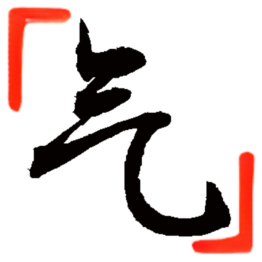

<div align="center">
  <a href="https://github.com/anonymousaaardvark/qi">
    
  </a>
</div>

<h2 align="center">气 (Qi) lang</h2>

  <p align="center">
    Qi is a lightweight, fast, and open source Chinese programming language.
    <br />
  </p>

<!-- ABOUT THE PROJECT -->
## About

After reading an article on how programming languages are created, I was inspired to create an interpreter myself. I took a look at how several languages were implemented, and realized that all of them were based on english. I wanted to make a programming language based on a "foreign" natural language, such as Chinese, and see what drawbacks it might lead to. I started simple by referencing various resources posted online (most notably [Crafting Interpreters](https://github.com/munificent/craftinginterpreters/)), and then slowly began implementing concepts mostly on my own. Turns out that creating an entire programming language from scratch is pretty tough, but that was what made it fun.

**Why name it Qi?** Qi was derived from the pinyin of the Chinese character "气", which means "air" in English. I wanted this language to be quick and lightweight, as well as fully transparent, just like air! 
```c
打印行（"你好，世界"）；
```
### Features
- Qi is <ins>Chinese-based</ins>. Us English-speaking people don't often take for granted the fact that the programming languages we learn are all based on native tongues we're already fluent in. A native English speaker can reasonably infer what a piece of Python code does just from reading the keywords ("if", "int", "while", etc.). Making this language foreign-based allows programming to be more accessible to more people around the globe.


- Qi is <ins>fast</ins>. Qi utilizes a single-pass compiler that compiles to efficient bytecode that runs exceptionally down to the metal. Along with various optimizations such as [Nan Boxing](https://sean.cm/a/nan-boxing) and hash table probing, Qi's speed squares up to competing dynamic languages.


- Qi is <ins>light</ins>. With less than 5000 lines of code, the entire project could be read in a day. Although the code is short, everything is well-formatted and easy to understand. The final executable is only about 140 kb in size, allowing you to run it on nearly any device imaginable.


- Qi is <ins>object-oriented</ins>. Placing classes front and center, [object-oriented programming](https://en.wikipedia.org/wiki/Object-oriented_programming) provides a clear modular structure that is significantly better at handling complexity than functional programming though concepts such as [abstraction](https://en.wikipedia.org/wiki/Abstraction_principle_(computer_programming)) and [encapsulation](https://en.wikipedia.org/wiki/Encapsulation_(computer_programming)).

## Syntax

The [Quick Start](quick_start.md) page is a great guide to install and set up the language.

For code examples, please refer to the [Tests](unit_tests.md).

For a more extensive look into Qi, go to the [Language Guide](syntax.md).


<!-- ROADMAP -->
## Roadmap

- [x] Classes
- [x] Inheritance
- [x] Lists
- [x] Increment/decrement operators
- [x] Switch/Case statements
- [x] Optimization
- [x] Translate everything to Chinese
- [x] Make a logo
- [x] Finish Readme
- [x] Translate Readme to Chinese
- [x] Create Website
  - [x] Front Page 
  - [x] Quick Start
  - [x] Language Guide
- [x] Escape Sequences
- [ ] Bitwise operators
- [ ] Remove semicolons
- [ ] Support scientific notation, binary, etc. numbers
- [ ] More string methods
- [ ] More list methods

<!-- LICENSE -->
## License

Distributed under the MIT License. See `LICENSE.txt` for more information.


<!-- CONTACT -->
## Contact

Andrew Yang - [@anonymousaaardvark](https://twitter.com/anonymousaaardvark) - andrewhuiyang0830@gmail.com

Project Link: [https://github.com/anonymousaaardvark/qi](https://github.com/anonymousaaardvark/qi)


<!-- ACKNOWLEDGMENTS -->
## Acknowledgments

* [Crafting Interpreters](https://craftinginterpreters.com/)
* [Gravity](https://github.com/marcobambini/gravity)
* [Loxido](https://github.com/ceronman/loxido)

<!-- MARKDOWN LINKS & IMAGES -->
<!-- https://www.markdownguide.org/basic-syntax/#reference-style-links -->
[loc-shield]: https://img.shields.io/tokei/lines/github/anonymousaaardvark/qi?style=for-the-badge
[loc-url]: https://github.com/anonymousaaardvark/qi
[last-commit-shield]: https://img.shields.io/github/last-commit/anonymousaaardvark/qi?style=for-the-badge
[last-commit-url]: https://github.com/anonymousaaardvark/qi
[commit-activity-shield]: https://img.shields.io/github/commit-activity/m/anonymousaaardvark/qi?style=for-the-badge
[commit-activity-url]: https://github.com/anonymousaaardvark/qi
[license-shield]: https://img.shields.io/github/license/anonymousaaardvark/qi?style=for-the-badge
[license-url]: https://github.com/anonymousaaardvark/qi
[website-shield]: https://img.shields.io/website?down_color=lightgrey&down_message=offline&style=for-the-badge&up_color=blue&up_message=online&url=https%3A%2F%2Fqilang.tk
[website-url]: https://qilang.tk
[size-shield]: https://img.shields.io/github/repo-size/anonymousaaardvark/qi?style=for-the-badge
[size-url]: https://github.com/anonymousaaardvark/qi
[background-img]: assets/images/background.jpeg